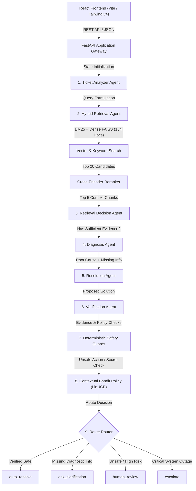

# ResolveX 2.0 — Final Architecture Specification

## 1. System Overview

ResolveX is an enterprise-grade agentic AI IT support ticket resolution platform. It combines a stateful **LangGraph** orchestration pipeline, hybrid retrieval (BM25 + FAISS), Cross-Encoder reranking, dual-stage LLM generation, deterministic evidence verification, contextual bandit decision policies, and fail-closed safety guards.

---

## 2. Component Specifications

### 2.1 Frontend Layer
- **Framework**: React 19, TypeScript, Vite, TailwindCSS v4.
- **Pages**: Main Dashboard, Ticket List, Simulation / Agent Execution, Audit Logs, Analytics.
- **API Client**: Service layer in [`Frontend/src/services/api.ts`](file:///d:/ResolveX-AI/Frontend/src/services/api.ts) with configurable `VITE_API_URL`.

### 2.2 API & Security Layer
- **Framework**: FastAPI, Uvicorn ASGI server.
- **Middleware**:
  - Request Correlation ID (`X-Request-ID` UUID v4).
  - Defensive Security Headers (`nosniff`, `DENY`, `no-referrer`, `CSP`).
  - Environment-driven CORS validation (Wildcard `*` prohibited when credentials enabled).
  - Global error sanitization (500 internal errors return safe JSON, stack trace logged server-side).

### 2.3 Agentic Graph Orchestration (LangGraph)
Stateful DAG state machine executing sequentially across 8 specialized node functions:
1. `ticket_analyzer`: Classifies intent, category, and diagnostic prerequisites.
2. `retrieval_agent`: Executes hybrid search over 154 KB documents.
3. `retrieval_decision_agent`: Evaluates evidence completeness and decides whether query rewrite is needed.
4. `diagnosis_agent`: Identifies root cause grounded strictly in retrieved evidence.
5. `resolution_agent`: Generates step-by-step remediation plan using `openai/gpt-oss-120b`.
6. `verification_agent`: Evaluates evidence support, policy compliance, and hallucination absence.
7. `decision_agent`: Computes composite confidence score ($0.4 \times \text{Similarity} + 0.3 \times \text{LLM} + 0.3 \times \text{Class}$).
8. `route_decision`: Evaluates deterministic guards and policy recommendation to determine final destination.

### 2.4 Hybrid Retrieval & Reranking Engine
- **BM25 Store**: Rank-BM25 keyword search over indexed DocumentStore.
- **Dense Vector Store**: FAISS Flat IP index (154 vectors, `sentence-transformers/all-MiniLM-L6-v2`, 384 dimensions).
- **Reranker**: `cross-encoder/ms-marco-MiniLM-L-6-v2` reranking top 20 candidate chunks down to top 5 context windows.

### 2.5 Policy & Safety Architecture
- **Decision Policy**: Contextual Bandits (`LinUCB`, `ThompsonSampling`, or `Heuristic`).
- **Deterministic Safety Guards**:
  - `UnsafeActionGuard`: Detects privilege escalation, destructive database commands (`DROP DATABASE`, `GRANT ROOT`, `rm -rf`), and system modifications, forcing route to `human_review`.
  - `SecretLeakageGuard`: Detects credentials in output text and overrides `auto_resolve` to `human_review`.
- **Fail-Closed Rule**: Policy decisions **cannot** override deterministic safety constraints.

### 2.6 Persistence & Observability
- **Database**: SQLAlchemy ORM with SQLite (local default) and AWS RDS PostgreSQL DSN support.
- **Observability**: LangSmith tracing integration (optional).
- **MLOps**: MLflow experiment tracking (optional).
- **CI/CD**: GitHub Actions pipeline ([`.github/workflows/ci.yml`](file:///d:/ResolveX-AI/.github/workflows/ci.yml)).
- **Deployment**: Systemd FastAPI Backend + Nginx Static React Frontend.
