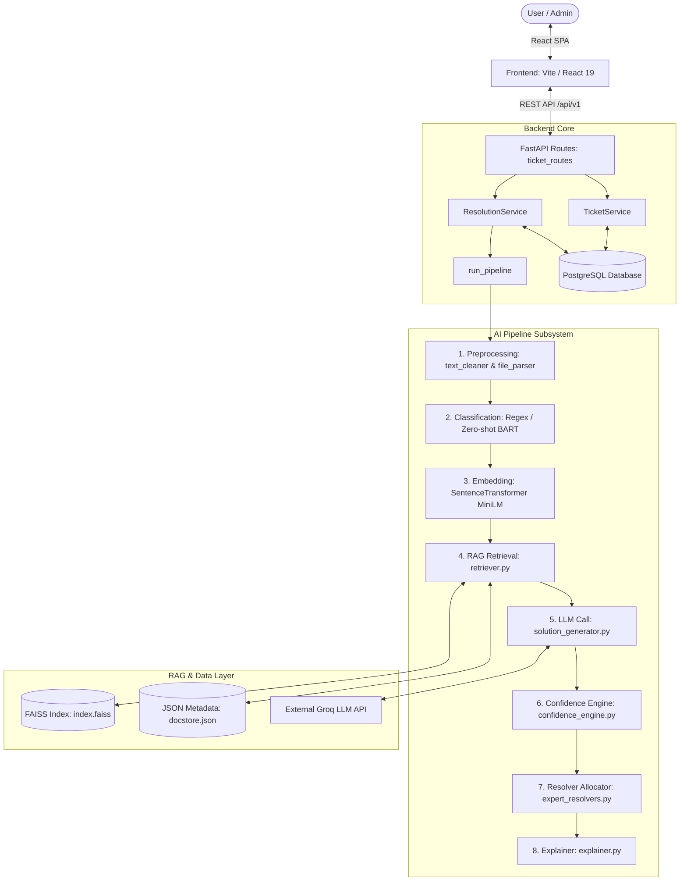

# ResolveX-AI — Current System Architecture

## 1. System Overview

ResolveX-AI is an automated IT support ticket resolution system designed around a synchronous 7-stage AI pipeline, a FastAPI REST backend, a PostgreSQL relational database, a local FAISS vector search store, and a React 19 single-page frontend.

### High-Level Topology

```text
React 19 Frontend (Vite SPA)
  ↓  HTTP REST requests (`/api/v1/*`)
FastAPI Backend (Uvicorn ASGI Server)
  ↓
Services Layer (TicketService / ResolutionService)
  ├── PostgreSQL Database (SQLAlchemy ORM via psycopg2)
  └── AI Resolution Pipeline (ticket_pipeline.py)
        ├── Text Preprocessor (text_cleaner & file_parser)
        ├── Classifier (Regex -> Zero-shot BART -> Groq LLM fallback)
        ├── Embedding Generator (SentenceTransformers all-MiniLM-L6-v2)
        ├── RAG Retriever (FAISS IndexFlatIP & JSON DocStore)
        ├── LLM Solution Generator (Groq API llama-3.3-70b-versatile)
        ├── Confidence Engine (Weighted Composite Formula)
        ├── Expert Resolver Allocator (Keyword match & Round-Robin)
        └── Explainer (Human-readable Markdown reasoning)
```

---

## 2. Component Architecture

### 2.1 Frontend Subsystem
* **Framework**: React 19.2, TypeScript 5.9, Vite 8.0, TailwindCSS 4.2.
* **Component Directory**: [Frontend/src/components/](file:///d:/ResolveX-AI/Frontend/src/components/) (`Navbar.tsx`, `Sidebar.tsx`, `ErrorBoundary.tsx`).
* **Views / Pages**: [Frontend/src/pages/](file:///d:/ResolveX-AI/Frontend/src/pages/) (`Analytics.tsx`, `AuditLogs.tsx`, `Dashboard.tsx`, `LandingPage.tsx`, `Simulation.tsx`, `TicketHistory.tsx`, `Ticketslist.tsx`).
* **API Integration**: Single API client module [Frontend/src/services/api.ts](file:///d:/ResolveX-AI/Frontend/src/services/api.ts) using native `fetch` against `http://localhost:8000/api/v1`.

### 2.2 API Layer
* **Framework**: FastAPI v0.115+ running on Uvicorn in [Backend/run.py](file:///d:/ResolveX-AI/Backend/run.py).
* **Application Factory**: [Backend/app/main.py](file:///d:/ResolveX-AI/Backend/app/main.py).
* **Routers**:
  * Health Routes: [health_routes.py](file:///d:/ResolveX-AI/Backend/app/routes/health_routes.py) (`/health`, `/health/ready`)
  * Ticket Routes: [ticket_routes.py](file:///d:/ResolveX-AI/Backend/app/routes/ticket_routes.py) (`POST /tickets`, `GET /tickets`, `GET /tickets/{id}`, `GET /tickets/{id}/pipeline`, `PATCH /tickets/{id}`, `DELETE /tickets/{id}`)
  * Resolution Routes: [resolution_routes.py](file:///d:/ResolveX-AI/Backend/app/routes/resolution_routes.py) (`POST /resolve/{id}`, `GET /resolve/{id}`, `POST /hitl/review`)
  * Analytics Routes: [analytics_routes.py](file:///d:/ResolveX-AI/Backend/app/routes/analytics_routes.py) (`GET /analytics`, `GET /analytics/tickets`, `GET /analytics/confidence`)

### 2.3 Service Layer
* **Ticket Service**: [ticket_service.py](file:///d:/ResolveX-AI/Backend/app/services/ticket_service.py) - Handles ticket persistence and pagination.
* **Resolution Service**: [resolution_service.py](file:///d:/ResolveX-AI/Backend/app/services/resolution_service.py) - Orchestrates AI execution, evaluates auto-resolution thresholds, and handles expert assignment.
* **HITL Service**: [hitl_service.py](file:///d:/ResolveX-AI/Backend/app/services/hitl_service.py) - Manages human agent review submissions.
* **Analytics Service**: [analytics_service.py](file:///d:/ResolveX-AI/Backend/app/services/analytics_service.py) - Summarizes status counts, confidence averages, and category breakdowns.

### 2.4 Repository Layer (DAL)
* **Ticket Repository**: [ticket_repo.py](file:///d:/ResolveX-AI/Backend/app/repositories/ticket_repo.py) - Raw SQLAlchemy queries on `tickets` table.
* **KB Repository**: [kb_repo.py](file:///d:/ResolveX-AI/Backend/app/repositories/kb_repo.py) - Queries on `knowledge_base` table.
* **User Repository**: [user_repo.py](file:///d:/ResolveX-AI/Backend/app/repositories/user_repo.py) - Queries on `users` table.

### 2.5 Database Subsystem
* **Engine**: PostgreSQL accessed via SQLAlchemy 2.0 and `psycopg2-binary`.
* **Models**: Defined in [Backend/app/models/](file:///d:/ResolveX-AI/Backend/app/models/) (`ticket_model.py`, `kb_model.py`, `user_model.py`).
* **Connection Management**: Session factory with `pool_pre_ping=True` in [database.py](file:///d:/ResolveX-AI/Backend/app/database.py).

### 2.6 AI Layer
* **Pipeline Master**: [ticket_pipeline.py](file:///d:/ResolveX-AI/Backend/ai/pipeline/ticket_pipeline.py) - Executes preprocessing, classification, embedding, retrieval, LLM call, confidence scoring, and explanation generation in 7 synchronous steps.
* **Classification**: [classifier.py](file:///d:/ResolveX-AI/Backend/ai/classification/classifier.py) - Regex rule engine -> `facebook/bart-large-mnli` zero-shot pipeline -> Groq LLM fallback.
* **Embedding**: [embedding_model.py](file:///d:/ResolveX-AI/Backend/ai/embedding/embedding_model.py) - Lazy-loaded `SentenceTransformer("sentence-transformers/all-MiniLM-L6-v2")` generating 384-dimensional dense vectors.
* **Confidence Engine**: [confidence_engine.py](file:///d:/ResolveX-AI/Backend/ai/confidence/confidence_engine.py) - Weighted linear combination formula.
* **Explainer**: [explainer.py](file:///d:/ResolveX-AI/Backend/ai/explainability/explainer.py) - Markdown explanation format builder.

### 2.7 RAG Subsystem
* **Vector Store**: [vector_store.py](file:///d:/ResolveX-AI/Backend/ai/rag/vector_store.py) - FAISS `IndexFlatIP` persisted at `Backend/data/faiss/index.faiss`.
* **Document Metadata Store**: [doc_store.py](file:///d:/ResolveX-AI/Backend/ai/rag/doc_store.py) - JSON file persisted at `Backend/data/faiss/docstore.json`.
* **Retriever**: [retriever.py](file:///d:/ResolveX-AI/Backend/ai/rag/retriever.py) - Top-K = 5 similarity search against FAISS index.

### 2.8 LLM Subsystem
* **Provider**: Groq Cloud API via `groq` Python SDK in [solution_generator.py](file:///d:/ResolveX-AI/Backend/ai/llm/solution_generator.py).
* **Model**: `llama-3.3-70b-versatile` / `llama3-8b-8192`.

### 2.9 Storage Subsystem
* **Storage Facade**: [file_manager.py](file:///d:/ResolveX-AI/Backend/storage/file_manager.py) wrapping [local_storage.py](file:///d:/ResolveX-AI/Backend/storage/local_storage.py), storing uploaded attachment files to `Backend/uploads/`.

### 2.10 Infrastructure & CI/CD
* **Workflows**: GitHub Actions in [.github/workflows/](file:///d:/ResolveX-AI/.github/workflows/).
  * `backend.yml`: Direct SSH to AWS EC2, code pull, venv setup, `pip install`, `sudo systemctl restart resolvex-backend`.
  * `frontend.yml`: Direct SSH to AWS EC2, `npm run build`, file copy to `/var/www/resolvex`, Nginx reload.

---

## 3. End-to-End Request Lifecycle

```text
User Submits Ticket (Title, Description, Category, Image)
  ↓
Frontend: submitTicket() in src/services/api.ts
  ↓ HTTP POST multipart/form-data to /api/v1/tickets
FastAPI Route: create_ticket() in app/routes/ticket_routes.py
  ↓
TicketService: create_ticket() in app/services/ticket_service.py
  ↓ Inserts Ticket row into PostgreSQL (status="open")
ResolutionService: resolve() in app/services/resolution_service.py
  ↓ Invokes run_pipeline() in ai/pipeline/ticket_pipeline.py
    ├── 1. clean_text() & parse_attachments()
    ├── 2. classify_ticket() -> category & classification_score
    ├── 3. generate_embedding() -> 384-dim vector
    ├── 4. retrieve_context() -> Top 5 docs from FAISS vector store
    ├── 5. generate_solution() -> Groq API (Llama 3.3 70B)
    ├── 6. compute_confidence() -> 0.4*sim + 0.3*llm + 0.3*cls
    └── 7. explain() -> Markdown explanation
  ↓ Decision Evaluation:
    If confidence >= 0.75:
      Set status = "auto_resolved"
    Else:
      Set status = "escalated"
      Assign expert resolver via get_best_expert_resolver()
  ↓ Updates Ticket in PostgreSQL with solution, confidence, status, resolver
FastAPI returns merged TicketResponse JSON
  ↓
Frontend renders AI Resolution result in Simulation / Ticket History UI
```

---

## 4. System Architecture Diagram



---

## 5. Architectural Decisions & Trade-offs

### Baseline Version: 1.1.0 (ResolveX v1.1 Baseline)

1. **Synchronous Execution Model**:
   * **Decision**: All 7 steps of `run_pipeline` execute sequentially inside the request-response thread of FastAPI.
   * **Impact**: Simplifies flow and maintains strict response guarantees before introducing asynchronous workers.
2. **FAISS Local Flat Index & Ingestion Pipeline**:
   * **Decision**: Uses `faiss.IndexFlatIP` (exact inner-product search on $L_2$-normalized vectors) paired with a persistent JSON document store (`docstore.json`). Paths are centralized under `app/config.py` (`data/faiss/index.faiss` and `data/faiss/docstore.json`). Automated rebuilding is provided by `scripts/build_index.py`.
   * **Impact**: Guaranteed alignment between vector count and JSON document store metadata across restarts.
3. **Groq Cloud LLM Integration**:
   * **Decision**: Sourced directly from centralized `Settings` using `llama-3.3-70b-versatile` with exponential backoff retries and fallback handling.
4. **Centralized Configuration**:
   * **Decision**: Single source of truth in `app/config.py` using Pydantic `BaseSettings`. Bridges in `ai/config/ai_config.py` re-export settings for zero configuration drift.
5. **Lazy-Loaded Models**:
   * **Decision**: Zero-shot classifier pipeline model is loaded on demand on first invocation rather than at module import time, dramatically accelerating startup times.

