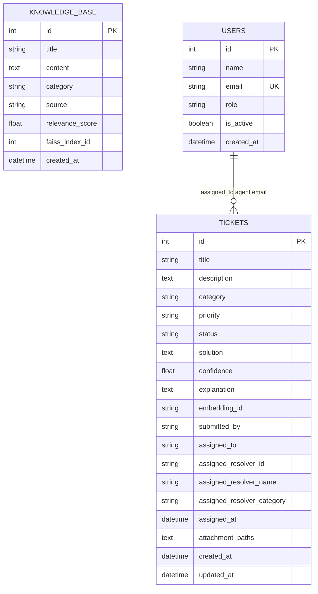

# ResolveX-AI — Database Architecture Specification

## 1. Overview

ResolveX-AI uses PostgreSQL as its relational database management system, interfaced via SQLAlchemy ORM (v2.0+) and `psycopg2-binary`.

Connection pooling is configured in [Backend/app/database.py](file:///d:/ResolveX-AI/Backend/app/database.py) with `pool_size=10`, `max_overflow=20`, `pool_timeout=30`, `pool_recycle=1800`, and `pool_pre_ping=True`.

---

## 2. Entity Relationship Diagram

---

## 3. Schema Definitions

### 3.1 Table: `tickets`

* **Source File**: [Backend/app/models/ticket_model.py](file:///d:/ResolveX-AI/Backend/app/models/ticket_model.py)

| Column | Type | Constraints | Default | Description |
| ------ | ---- | ----------- | ------- | ----------- |
| `id` | Integer | Primary Key, Indexed, Autoincrement | — | Unique ticket identifier |
| `title` | String(255) | Non-nullable | — | Ticket summary title |
| `description` | Text | Non-nullable | — | Detailed problem description |
| `category` | String(100) | Nullable | — | Ticket classification category |
| `priority` | String(50) | Nullable | `"medium"` | Priority level (`low`, `medium`, `high`, `critical`) |
| `status` | String(50) | Nullable | `"open"` | Status (`open`, `in_progress`, `auto_resolved`, `escalated`, `closed`) |
| `solution` | Text | Nullable | — | AI-generated or human resolution text |
| `confidence` | Float | Nullable | — | AI confidence score in $[0.0, 1.0]$ |
| `explanation` | Text | Nullable | — | Markdown explanation generated by AI |
| `embedding_id` | String(255) | Nullable | — | FAISS vector reference identifier |
| `submitted_by` | String(255) | Nullable | — | Email or user ID of submitter |
| `assigned_to` | String(255) | Nullable | — | Email of human agent (HITL review) |
| `assigned_resolver_id` | String(50) | Nullable | — | Assigned expert resolver ID (e.g., `res_sw_01`) |
| `assigned_resolver_name` | String(100) | Nullable | — | Assigned expert resolver full name |
| `assigned_resolver_category` | String(100) | Nullable | — | Assigned expert resolver category |
| `assigned_at` | DateTime(tz) | Nullable | — | Timestamp of resolver assignment |
| `attachment_paths` | Text | Nullable | — | Comma-separated list of uploaded file names |
| `created_at` | DateTime(tz) | Server default `now()` | `now()` | Ticket creation timestamp |
| `updated_at` | DateTime(tz) | On update `now()` | — | Ticket last update timestamp |

---

### 3.2 Table: `knowledge_base`

* **Source File**: [Backend/app/models/kb_model.py](file:///d:/ResolveX-AI/Backend/app/models/kb_model.py)

| Column | Type | Constraints | Default | Description |
| ------ | ---- | ----------- | ------- | ----------- |
| `id` | Integer | Primary Key, Indexed, Autoincrement | — | Unique KB entry ID |
| `title` | String(255) | Non-nullable | — | Knowledge article title |
| `content` | Text | Non-nullable | — | Knowledge article body / solution text |
| `category` | String(100) | Nullable | — | Knowledge category |
| `source` | String(100) | Nullable | `"ticket"` | Source origin (`ticket`, `article`, `manual`) |
| `relevance_score` | Float | Nullable | — | Cached relevance score |
| `faiss_index_id` | Integer | Nullable | — | Corresponding index position in FAISS |
| `created_at` | DateTime(tz) | Server default `now()` | `now()` | Record creation timestamp |

---

### 3.3 Table: `users`

* **Source File**: [Backend/app/models/user_model.py](file:///d:/ResolveX-AI/Backend/app/models/user_model.py)

| Column | Type | Constraints | Default | Description |
| ------ | ---- | ----------- | ------- | ----------- |
| `id` | Integer | Primary Key, Indexed, Autoincrement | — | Unique user ID |
| `name` | String(255) | Non-nullable | — | User full name |
| `email` | String(255) | Unique, Non-nullable, Indexed | — | User email address |
| `role` | String(50) | Nullable | `"agent"` | User role (`agent`, `admin`) |
| `is_active` | Boolean | Nullable | `True` | Account active flag |
| `created_at` | DateTime(tz) | Server default `now()` | `now()` | User creation timestamp |

---

## 4. Initialization & Migration Strategy

* **Initialization**: Tables are created automatically on startup via `Base.metadata.create_all(bind=engine)` inside the FastAPI lifespan context manager (`init_db()` in [database.py](file:///d:/ResolveX-AI/Backend/app/database.py#L49)).
* **Database Migrations**: While `alembic` is listed in `Backend/requirements.txt`, **no Alembic migration scripts or directories currently exist** in the repository. All schema changes must currently be handled via `create_all` or manual SQL DDL commands.
* **Session Lifecycle**: Database sessions are provided to FastAPI routes using `Depends(get_db)`, which yields a `SessionLocal` instance and closes it in a `finally` block.
